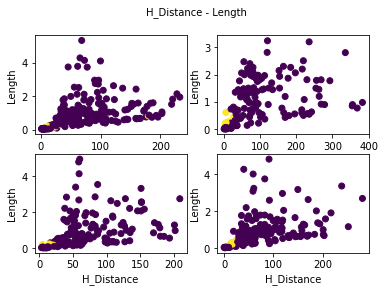
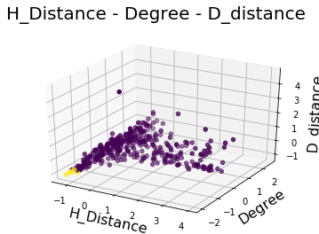

## Preprocessing

##### 1. Loading data:

The stroke statistics are stored in quadruples for each stroke, paired with the predeterined horizontal value. 


```python
stat = pickle.load(open('stat', 'rb'))
pd_stat_per_file = [pd.DataFrame(np.array(file), columns=['Degree', 'H_Dist', 'D_Dist', 'Length', 'Horizontal']) 
                 for file in stat]

np_stat_per_file = np.array([np.array(file) for file in stat])

summerized_stat = []

for file in stat:
    for stroke in file:
        summerized_stat.append(stroke)

# All of the stroke parameter vectors are stored in this variable.
np_stat = np.array(summerized_stat)

data_length = len(np_stat)

for data_frame in pd_stat_per_file:
    print(data_frame.head())
```

          Degree      H_Dist      D_Dist    Length  Horizontal
    0  70.204014  124.916667    6.925876  0.508186         0.0
    1  34.067554  122.906250  136.099238  1.802150         0.0
    2  72.038094  227.611111   92.824134  2.147402         0.0
    3  78.323396  145.500000    4.872088  0.613679         0.0
    4  37.804315   45.500000   18.753902  0.506339         1.0
        Degree   H_Dist   D_Dist    Length Horizontal
    0  106.197  382.821  15.3378  0.979135          0
    1  64.8474  292.844  129.261   1.77307          0
    2   51.413  184.567  116.328   2.26148          0
    3  23.7136  5.70833  3.97414   0.61202          1
    4  95.6023  354.583  4.32749  0.854233          0
           Degree    H_Dist     D_Dist    Length  Horizontal
    0   76.028415  193.1875  14.142646  0.564846         0.0
    1   10.142556   17.2500   5.880144  0.289417         1.0
    2   77.450204  201.5625  34.418326  0.982743         0.0
    3  100.146923   61.1500  58.507085  0.557228         0.0
    4   41.729833   44.3125  37.873035  0.353547         0.0


##### 2. Visualizing data:

Average degree is calculated by taking the avarge of the included angle between every vector defined by each consecutive points and a horizontal line.
The second parameter is the average of the distance of a stroke's points from the horizontal line that goes through that stroke's first point.
The third parameter is similar to the previous one, in that measurement is the average distance from a line, altough it is now a line that is defined by the directional vector from the first to the last point.
Fourth parameter is the stroke's length divided by the average length of the text's strokes.


```python
fig = plt.figure()
fig.suptitle('Degree - Length', fontsize=10)
fig.add_subplot(2,2,1)
plt.scatter(np_stat_per_file[0][:,0], np_stat_per_file[0][:,3], c=np_stat_per_file[0][:,4])
plt.xlabel('Degree', fontsize=10)
plt.ylabel('Length', fontsize=10)
fig.add_subplot(2,2,2)
plt.scatter(np_stat_per_file[1][:,0], np_stat_per_file[1][:,3], c=np_stat_per_file[1][:,4])
plt.xlabel('Degree', fontsize=10)
plt.ylabel('Length', fontsize=10)
fig.add_subplot(2,2,3)
plt.scatter(np_stat_per_file[2][:,0], np_stat_per_file[2][:,3], c=np_stat_per_file[2][:,4])
plt.xlabel('Degree', fontsize=10)
plt.ylabel('Length', fontsize=10)
fig.add_subplot(2,2,4)
plt.scatter(np_stat_per_file[3][:,0], np_stat_per_file[3][:,3], c=np_stat_per_file[3][:,4])
plt.xlabel('Degree', fontsize=10)
plt.ylabel('Length', fontsize=10)
```


    <matplotlib.text.Text at 0x7f4379616c88>


```python
fig = plt.figure()
fig.suptitle('H_Distance - Length', fontsize=10)
fig.add_subplot(2,2,1)
plt.scatter(np_stat_per_file[0][:,1], np_stat_per_file[0][:,3], c=np_stat_per_file[0][:,4])
plt.xlabel('H_Distance', fontsize=10)
plt.ylabel('Length', fontsize=10)
fig.add_subplot(2,2,2)
plt.scatter(np_stat_per_file[1][:,1], np_stat_per_file[1][:,3], c=np_stat_per_file[1][:,4])
plt.xlabel('H_Distance', fontsize=10)
plt.ylabel('Length', fontsize=10)
fig.add_subplot(2,2,3)
plt.scatter(np_stat_per_file[2][:,1], np_stat_per_file[2][:,3], c=np_stat_per_file[2][:,4])
plt.xlabel('H_Distance', fontsize=10)
plt.ylabel('Length', fontsize=10)
fig.add_subplot(2,2,4)
plt.scatter(np_stat_per_file[3][:,1], np_stat_per_file[3][:,3], c=np_stat_per_file[3][:,4])
plt.xlabel('H_Distance', fontsize=10)
plt.ylabel('Length', fontsize=10)
```


    <matplotlib.text.Text at 0x7f4373af3438>





```python
fig = plt.figure()
fig.suptitle('H_Distance - D_Distance', fontsize=10)
fig.add_subplot(2,2,1)
plt.scatter(np_stat_per_file[0][:,1], np_stat_per_file[0][:,2], c=np_stat_per_file[0][:,4])
plt.xlabel('H_Distance', fontsize=10)
plt.ylabel('D_Distance', fontsize=10)
fig.add_subplot(2,2,2)
plt.scatter(np_stat_per_file[1][:,1], np_stat_per_file[1][:,2], c=np_stat_per_file[1][:,4])
plt.xlabel('H_Distance', fontsize=10)
plt.ylabel('D_Distance', fontsize=10)
fig.add_subplot(2,2,3)
plt.scatter(np_stat_per_file[2][:,1], np_stat_per_file[2][:,2], c=np_stat_per_file[2][:,4])
plt.xlabel('H_Distance', fontsize=10)
plt.ylabel('D_Distance', fontsize=10)
fig.add_subplot(2,2,4)
plt.scatter(np_stat_per_file[3][:,1], np_stat_per_file[3][:,2], c=np_stat_per_file[3][:,4])
plt.xlabel('H_Distance', fontsize=10)
plt.ylabel('D_Distance', fontsize=10)
```


    <matplotlib.text.Text at 0x7f7744eb60f0>


```python
fig = plt.figure()
fig.suptitle('H_Distance - Degree', fontsize=10)
fig.add_subplot(2,2,1)
plt.scatter(np_stat_per_file[0][:,1], np_stat_per_file[0][:,0], c=np_stat_per_file[0][:,4])
plt.xlabel('H_Distance', fontsize=10)
plt.ylabel('Degree', fontsize=10)
fig.add_subplot(2,2,2)
plt.scatter(np_stat_per_file[1][:,1], np_stat_per_file[1][:,0], c=np_stat_per_file[1][:,4])
plt.xlabel('H_Distance', fontsize=10)
plt.ylabel('Degree', fontsize=10)
fig.add_subplot(2,2,3)
plt.scatter(np_stat_per_file[2][:,1], np_stat_per_file[2][:,0], c=np_stat_per_file[2][:,4])
plt.xlabel('H_Distance', fontsize=10)
plt.ylabel('Degree', fontsize=10)
fig.add_subplot(2,2,4)
plt.scatter(np_stat_per_file[3][:,1], np_stat_per_file[3][:,0], c=np_stat_per_file[3][:,4])
plt.xlabel('H_Distance', fontsize=10)
plt.ylabel('Degree', fontsize=10)
```


    <matplotlib.text.Text at 0x7f7744d14f28>


```python
fig = plt.figure()
fig.suptitle('H_Distance - Degree - D_distance', fontsize=20)
ax = fig.add_subplot(111, projection='3d')
ax.scatter(np_stat_per_file[0][:,1], np_stat_per_file[0][:,0],
                                              np_stat_per_file[0][:,2], c=np_stat_per_file[0][:,4])
ax.set_xlabel('H_Distance', fontsize=16)
ax.set_ylabel('Degree', fontsize=16)
ax.set_zlabel('D_distance', fontsize=16)
```


    <matplotlib.text.Text at 0x7fe44d92ad68>


##### 3. Spitting data:

First step is to separate the stroke data vector into 5 columns.


```python
avg_degree = np_stat[:,0]
h_distance = np_stat[:,1]
d_distance = np_stat[:,2]
length = np_stat[:,3]
h_value = np_stat[:,4]
```

Each column is divided into 3 parts, train, validation and test data.


```python
train_split = 0.7
valid_split = 0.2
test_split = 0.1

train_avg_degree = np.array(avg_degree[:data_length-int(data_length*0.1)-int(data_length*0.2)], dtype='float').reshape(-1, 1)
train_h_distance = np.array(h_distance[:data_length-int(data_length*0.1)-int(data_length*0.2)], dtype='float').reshape(-1, 1)
train_d_distance = np.array(d_distance[:data_length-int(data_length*0.1)-int(data_length*0.2)], dtype='float').reshape(-1, 1)
train_length = np.array(length[:data_length-int(data_length*0.1)-int(data_length*0.2)], dtype='float').reshape(-1, 1)
train_h_value = np.array(h_value[:data_length-int(data_length*0.1)-int(data_length*0.2)], dtype='float').reshape(-1, 1)

valid_avg_degree = np.array(avg_degree[data_length-int(data_length*0.1)-int(data_length*0.2):data_length-int(data_length*0.1)], dtype='float').reshape(-1, 1)
valid_h_distance = np.array(h_distance[data_length-int(data_length*0.1)-int(data_length*0.2):data_length-int(data_length*0.1)], dtype='float').reshape(-1, 1)
valid_d_distance = np.array(d_distance[data_length-int(data_length*0.1)-int(data_length*0.2):data_length-int(data_length*0.1)], dtype='float').reshape(-1, 1)
valid_length = np.array(length[data_length-int(data_length*0.1)-int(data_length*0.2):data_length-int(data_length*0.1)], dtype='float').reshape(-1, 1)
valid_h_value = np.array(h_value[data_length-int(data_length*0.1)-int(data_length*0.2):data_length-int(data_length*0.1)], dtype='float').reshape(-1, 1)

test_avg_degree = np.array(avg_degree[data_length-int(data_length*0.1):], dtype='float').reshape(-1, 1)
test_h_distance = np.array(h_distance[data_length-int(data_length*0.1):], dtype='float').reshape(-1, 1)
test_d_distance = np.array(d_distance[data_length-int(data_length*0.1):], dtype='float').reshape(-1, 1)
test_length = np.array(length[data_length-int(data_length*0.1):], dtype='float').reshape(-1, 1)
test_h_value = np.array(h_value[data_length-int(data_length*0.1):], dtype='float').reshape(-1, 1)
```

Standarization of each parameter.


```python
degree_scaler = preprocessing.StandardScaler().fit(train_avg_degree)
h_distance_scaler = preprocessing.StandardScaler().fit(train_h_distance)
d_distance_scaler = preprocessing.StandardScaler().fit(train_d_distance)
length_scaler = preprocessing.StandardScaler().fit(train_length)

train_avg_degree = degree_scaler.transform(train_avg_degree)
train_h_distance = h_distance_scaler.transform(train_h_distance)
train_d_distance = d_distance_scaler.transform(train_d_distance)
train_length = length_scaler.transform(train_length)

valid_avg_degree = degree_scaler.transform(valid_avg_degree)
valid_h_distance = h_distance_scaler.transform(valid_h_distance)
valid_d_distance = d_distance_scaler.transform(valid_d_distance)
valid_length = length_scaler.transform(valid_length)

test_avg_degree = degree_scaler.transform(test_avg_degree)
test_h_distance = h_distance_scaler.transform(test_h_distance)
test_d_distance = d_distance_scaler.transform(test_d_distance)
test_length = length_scaler.transform(test_length)
```

Reshaping the four parameter arrays into a single matrix.


```python
temp_array = np.array([train_avg_degree, train_h_distance, train_d_distance, train_length])
std_train_input = []
for i in range(temp_array.shape[1]):
    std_train_input.append(temp_array[:,i])

temp_array = np.array([valid_avg_degree, valid_h_distance, valid_d_distance, valid_length])
std_valid_input = []
for i in range(temp_array.shape[1]):
    std_valid_input.append(temp_array[:,i])

temp_array = np.array([test_avg_degree, test_h_distance, test_d_distance, test_length])
std_test_input = []
for i in range(temp_array.shape[1]):
    std_test_input.append(temp_array[:,i])
    
std_train_input = np.array(std_train_input).reshape(np.array(std_train_input).shape[0], np.array(std_train_input).shape[1])
std_valid_input = np.array(std_valid_input).reshape(np.array(std_valid_input).shape[0], np.array(std_valid_input).shape[1])
std_test_input = np.array(std_test_input).reshape(np.array(std_test_input).shape[0], np.array(std_test_input).shape[1])

pd.DataFrame(std_valid_input, columns=['Degree', 'H_Dist', 'D_Dist', 'Length'])
```


<div>
<table border="1" class="dataframe">
  <thead>
    <tr style="text-align: right;">
      <th></th>
      <th>Degree</th>
      <th>H_Dist</th>
      <th>D_Dist</th>
      <th>Length</th>
    </tr>
  </thead>
  <tbody>
    <tr>
      <th>0</th>
      <td>0.973195</td>
      <td>1.565696</td>
      <td>0.830618</td>
      <td>0.412334</td>
    </tr>
    <tr>
      <th>1</th>
      <td>1.011067</td>
      <td>-0.123480</td>
      <td>0.581926</td>
      <td>-0.180973</td>
    </tr>
    <tr>
      <th>2</th>
      <td>-0.956085</td>
      <td>-0.025428</td>
      <td>1.325921</td>
      <td>-0.165408</td>
    </tr>
    <tr>
      <th>3</th>
      <td>-0.771256</td>
      <td>-0.162701</td>
      <td>0.618017</td>
      <td>0.002390</td>
    </tr>
    <tr>
      <th>4</th>
      <td>0.080085</td>
      <td>-0.117435</td>
      <td>0.448124</td>
      <td>-0.253111</td>
    </tr>
    <tr>
      <th>5</th>
      <td>-0.268375</td>
      <td>0.439462</td>
      <td>0.473577</td>
      <td>0.185973</td>
    </tr>
    <tr>
      <th>6</th>
      <td>-1.333850</td>
      <td>0.330948</td>
      <td>1.397281</td>
      <td>4.361579</td>
    </tr>
    <tr>
      <th>742</th>
      <td>1.871316</td>
      <td>-0.349466</td>
      <td>-0.053142</td>
      <td>-0.098412</td>
    </tr>
    <tr>
      <th>743</th>
      <td>-0.196208</td>
      <td>0.041807</td>
      <td>0.353192</td>
      <td>0.992159</td>
    </tr>
    <tr>
      <th>744</th>
      <td>1.038170</td>
      <td>-0.733269</td>
      <td>-0.125464</td>
      <td>-0.332756</td>
    </tr>
  </tbody>
</table>
<p>745 rows × 4 columns</p>
</div>


## Building model

The model is a fully connected network, it has 4 input features for the 4 stroke parameters. There is one hidden layer, with 10 neurons, and a 0.5 dropout. It uses tanh activation in the hidden and output layer as well.


```python
model = Sequential()
model.add(Dense(input_dim=4, units=10, activation='sigmoid'))
model.add(Dropout(0.5))
model.add(Dense(units=1, activation='linear'))
```

There are 3 callback functions in the model, early stopping, model checkpoint and learning rate reduction.


```python
from keras.callbacks import EarlyStopping
patience = 50
early_stopping = EarlyStopping(patience=patience, verbose=1)

from keras.callbacks import ModelCheckpoint
checkpointer = ModelCheckpoint(filepath='weights.hdf5', save_best_only=True, verbose=1)

from keras.callbacks import ReduceLROnPlateau
reduce_lr = ReduceLROnPlateau(monitor='val_loss', factor=0.2, patience=5, min_lr=10e-5)
```

Training phase.


```python
sgd = SGD(lr=0.1, decay=1e-6, momentum=0.9, nesterov=True)
model.compile(loss='mse', optimizer=sgd)
history = model.fit(std_train_input, train_h_value ,epochs=1000000, batch_size=20,
                    validation_data=(std_valid_input,valid_h_value),
                   callbacks=[early_stopping, checkpointer, reduce_lr])
```

    Train on 2611 samples, validate on 745 samples
    Epoch 1/1000000
    2120/2611 [=======================>......] - ETA: 0s - loss: 0.0980Epoch 00000: val_loss did not improve
    2611/2611 [==============================] - 0s - loss: 0.0932 - val_loss: 0.1109
    Epoch 2/1000000
    2520/2611 [===========================>..] - ETA: 0s - loss: 0.0703Epoch 00001: val_loss did not improve
    2611/2611 [==============================] - 0s - loss: 0.0722 - val_loss: 0.0690
    Epoch 3/1000000
    2440/2611 [===========================>..] - ETA: 0s - loss: 0.0678Epoch 00002: val_loss did not improve
    2611/2611 [==============================] - 0s - loss: 0.0676 - val_loss: 0.0704
    Epoch 4/1000000
    2080/2611 [======================>.......] - ETA: 0s - loss: 0.0667Epoch 00003: val_loss did not improve
    2611/2611 [==============================] - 0s - loss: 0.0659 - val_loss: 0.0672
    2380/2611 [==========================>...] - ETA: 0s - loss: 0.0456Epoch 00096: val_loss did not improve
    2611/2611 [==============================] - 0s - loss: 0.0464 - val_loss: 0.0496
    Epoch 98/1000000
    2380/2611 [==========================>...] - ETA: 0s - loss: 0.0449Epoch 00097: val_loss did not improve
    2611/2611 [==============================] - 0s - loss: 0.0456 - val_loss: 0.0496
    Epoch 99/1000000
    2480/2611 [===========================>..] - ETA: 0s - loss: 0.0456Epoch 00098: val_loss did not improve
    2611/2611 [==============================] - 0s - loss: 0.0454 - val_loss: 0.0496
    Epoch 100/1000000
    2060/2611 [======================>.......] - ETA: 0s - loss: 0.0461Epoch 00099: val_loss did not improve
    2611/2611 [==============================] - 0s - loss: 0.0468 - val_loss: 0.0496
    Epoch 00099: early stopping


Visualizing prediciton data.


```python
preds = model.predict(std_test_input)

outputs= [1 if p > 0.5 else 0 for p in preds]

fig = plt.figure()
fig.suptitle('H_Distance - Degree - D_distance', fontsize=20)
ax = fig.add_subplot(111, projection='3d')
ax.scatter(std_test_input[:,1], std_test_input[:,0],
                                              std_test_input[:,2], c=outputs)
ax.set_xlabel('H_Distance', fontsize=16)
ax.set_ylabel('Degree', fontsize=16)
ax.set_zlabel('D_distance', fontsize=16)
```


    <matplotlib.text.Text at 0x7f76e12d9ac8>


