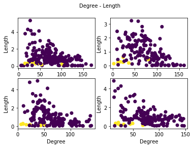
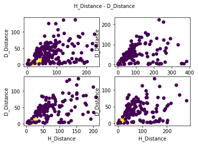
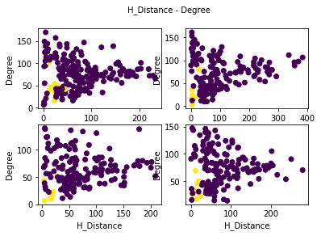
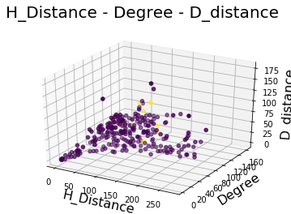
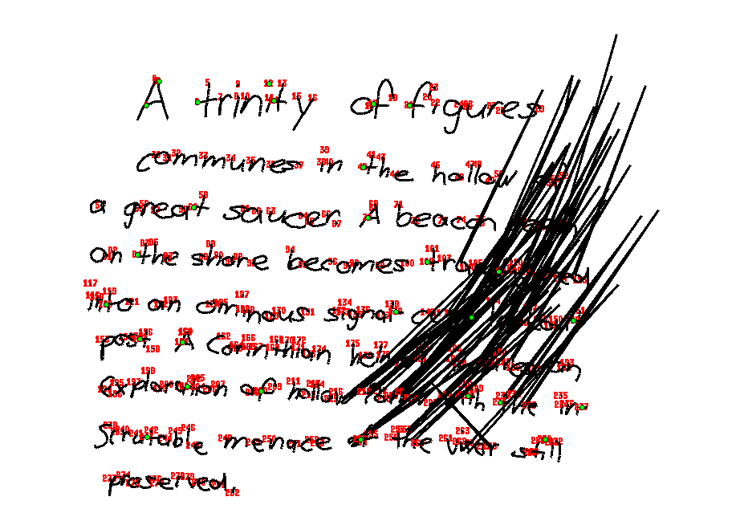

# Absztrakt

A feladat egy olyan program készítése volt, mely segítségével a felhasznanló a rendelkezése álló digitálisan tárolt, kézzel írott szövegmintákat elemezhet, böngészhet köztük. A fő szempont az írók jobb- vagy balkezességének meghatározása. Ennek az alapja az a hipotézis, mely alapján azok az emberek, akik az esetek relatív nagy részében végzik a vízszintes rövid vonalak húzását jobbról balra, azok balkezesek, valamint aki szinte mindig balról jobbra teszi ezt, az jobbkezesnek lesznek sorolva.

### Első lépések

Az alkalmazás készítéséhez egy három főből álló csapattal kezdtünk neki, így a hatékony munka érdekében két modulra bontottuk a problémát. Egyikünk a felhasználói felülettel foglalkozott, ketten pedig az aláírások elemzését végző algoritmus elkészítését végezte.


# Tervezés

##### Adatok

A program működése alapvetően egyszerű, mivel a rendelkezésre álló aláírásokat rövid időintervallumonként feljegyzett pontok halmazaként kaptuk meg. A szöveg, és az ahhoz tartozó további információk XML fájlokban vannak tárolva, amiknek a program működésének szempontjából egy fontos tulajdonsága, hogy azok a pontok, melyeket az író egy tollvonással írt le, külön XML tag-ben kerültek feljegyzésre. Másik lényeges tulajdonásga a fájloknak, hogy a kézzel írt szöveg tagolásával konzisztensen vannak elhelyezeve a sortörések a Text tag-ben. Ezeknek a jelentősége a működés részletesebb leírásánál lesz ismertetve.

##### Algoritmus

A tervezésnél megpróbáltuk egy olyan irányból megközelíteni a problémát, mely a rendelkezésre álló adatok tulajdonságait legjobban kihasználja. Itt jött képbe a már korábban említett XML ponthalmaz kedvező szegmentálása, ugyanis ezt felhasználva elegendő nekünk megkeresni azokat a tollhúzásokat, melyek rövidek, valamint többnyire vízszintesek. Ezeknek a vonalaknak a megtalálását követően, eldönti a program, hogy az jobbról, vagy balról lett-e húzva, majd a számuktól függően osztályozza a szöveg íróját.

##### Fejlesztés

A program készítése közben szerettük volna ellenrőzni, illetve kipróbálni az eddigi eredményeket, így elkészítettünk egy környezetet, mely a kész felhasználói felülethez hasonlóan képes megjeleníteni a szöveget, és kisebb mértékben manipulálhatjuk azt.

##### Technológiák

A fejlesztéshez Python-t választottunk, az egyszerűen és hatékony könyvtárai miatt. Az algoritmus működéséhez Tensorflow-t és Keras-t használtunk, valamint a GUI-t Tkinter-rel készítettük el.


# Implementáció

### Teszt GUI

Nem volt célunk, hogy egy teljes funkcionalitású felhasználói felületet készítsünk, az egyszerűségre és gyorsaságra törekedtünk, valamint fontos szempont volt, hogy az algoritmus és az ideiglenes teszt felület interfésze azonos legyen a későbbi, végleges felülettel, hogy könnyen tudjuk csatolni egymáshoz a két modult. Több hasznos funkció is implementációra került, például adott pontra történő zoomolás, adott tollhúzás sorszáma megjelenítése a képernyőn (melyre azért volt szükség, hogy a tanuló algoritmusnak szolgáltatott elvárt értékeket szemre meg tudjuk állapítani), vonások váltakozó színnel történő kitöltése (könnyítette a húzások vizuális elválasztását).

### Osztályozás

##### Algoritmus választása

Több módszerrel is nekikezdtünk a vízszintes vonalak kiszűréséhez a ponthalmazok közül, viszont egyik sem bizonyult megbízhatónak a rengeteg eltérő írástípus miatt. Több olyan mintával is találkoztunk, ahol az áthúzásokat teljesen vízszintesen tették, ezeket könnyen megtalálták, azok az algoritmusok, melyek például, azokat a húzásokat osztályozták “jó” ponthalmaznak, amiknek a pontjai adott távolságon belül esnek a két végpontot összekötő egyenestől. Problémát jelentett, azonban a minták többsége, ahol egyáltalán nem járt sikerrel ez a módszer, illetve működsére bírhattuk volna, viszont ehhez rengeteg mellékfeltételt kellett volna írnunk, így egy nagy if else szerkezetté téve az egész programot, ami unalmas és nem kifejezetten átlátható megoldásnak tűnt. Így végül egy neurális hálóra bízva az osztályozás feladatát próbáltunk javítani az eredményeken. 

##### Adatok előkészítése

Első kérdés az volt, hogy a neurális háló pontosan milyen adatok alapján lenne képes a lehető legjobb eredményt produkálni. Végül úgy döntöttük, hogy több különböző attribútummal látjuk el a ponthalmazokat, és ezek alapján fogja meghatározni, hogy melyek azok a tulajdonságok, melyek a leginkább jellemzőek a vízszintes áthúzásokra. Négy mérőszámot hoztunk létre:

1. A kezdő- és a végpontot összekötő szakasztól való átlagos távolság.
2. A kezdőponttól a az összes többi pontba húzott szakasz átlagos szöge.
3. A kezdőponton áthaladó vízszintes egyenestől vett átlagos távolsága a pontoknak.
4. A húzás hossza.

Az adatokat tartamazó XML fájl mappáján végigfut az algoritmus, és összegzi az összes vonalhúzásra a statisztikákat egy külön fájlban. Ezt követően a teszteléshez használt ideiglenes felhasználói felület felhasználásával, végig kell menni a beolvasott fájlokon, és kézzel kiírni egy text fájlba soronként, azoknak a húzásoknak az indexeit, melyek valóban vízszintes húzások. A program a következő lépésben ezt a két fájlt felhasználva előállítja a tanításhoz használt adatokat, és skálázás után, valamint tanító, teszt, validációs mintákra bontást követően elindul a tanítás.

##### Problémák

Az adatok előkészítése során több problémába is ütköztünk, például az XML fájlok rengeteg hibás adatot tartalmaztak. Ez alatt olyan pontokat kell érteni, melyeket az írás közben hibásan regisztrált be a táblagép, és ezért nagy ugrások keletkeztek két egymást követő pont után. Ez nagy mértékben rontotta az osztályozás sikerességét, mivel nem elszigetelt jelenségről van szó, akár minden 5. fájlban is előfordulhatott hasonló zajos adat. Problémát jelentettek még azok a húzások, melyek nem tartalmaztak pontokat, illetve csak 1 vagy 2 pontból álltak. Ezek nem fordultak elő gyakran, de ettől függetlenül kezelni kellett az ilyen szélsőséges eseteket is.

### Neurális háló


#### Preprocessing

##### 1. Loading data:

The stroke statistics are stored in quadruples for each stroke, paired with the predeterined horizontal value. 


```python
stat = pickle.load(open('stat', 'rb'))
pd_stat_per_file = [pd.DataFrame(np.array(file), columns=['Degree', 'H_Dist', 'D_Dist', 'Length', 'Horizontal']) 
                 for file in stat]

...

# All of the stroke parameter vectors are stored in this variable.
np_stat = np.array(summerized_stat)

data_length = len(np_stat)

for data_frame in pd_stat_per_file:
    print(data_frame.head())
```

          Degree      H_Dist      D_Dist    Length  Horizontal
    0  70.204014  124.916667    6.925876  0.508186         0.0
    1  34.067554  122.906250  136.099238  1.802150         0.0
    2  72.038094  227.611111   92.824134  2.147402         0.0
    3  78.323396  145.500000    4.872088  0.613679         0.0
    4  37.804315   45.500000   18.753902  0.506339         1.0
        Degree   H_Dist   D_Dist    Length Horizontal
    0  106.197  382.821  15.3378  0.979135          0
    1  64.8474  292.844  129.261   1.77307          0
    2   51.413  184.567  116.328   2.26148          0
    3  23.7136  5.70833  3.97414   0.61202          1
    4  95.6023  354.583  4.32749  0.854233          0
           Degree    H_Dist     D_Dist    Length  Horizontal
    0   76.028415  193.1875  14.142646  0.564846         0.0
    1   10.142556   17.2500   5.880144  0.289417         1.0
    2   77.450204  201.5625  34.418326  0.982743         0.0
    3  100.146923   61.1500  58.507085  0.557228         0.0
    4   41.729833   44.3125  37.873035  0.353547         0.0


##### 2. Visualizing data:

Average degree is calculated by taking the avarge of the included angle between every vector defined by each consecutive points and a horizontal line.
The second parameter is the average of the distance of a stroke's points from the horizontal line that goes through that stroke's first point.
The third parameter is similar to the previous one, in that measurement is the average distance from a line, altough it is now a line that is defined by the directional vector from the first to the last point.
Fourth parameter is the stroke's length divided by the average length of the text's strokes.


```python
fig = plt.figure()
fig.suptitle('Degree - Length', fontsize=10)
fig.add_subplot(2,2,1)
plt.scatter(np_stat_per_file[0][:,0], np_stat_per_file[0][:,3], c=np_stat_per_file[0][:,4])
plt.xlabel('Degree', fontsize=10)
plt.ylabel('Length', fontsize=10)

...
```




```python
fig = plt.figure()
fig.suptitle('H_Distance - Length', fontsize=10)
fig.add_subplot(2,2,1)
plt.scatter(np_stat_per_file[0][:,1], np_stat_per_file[0][:,3], c=np_stat_per_file[0][:,4])
plt.xlabel('H_Distance', fontsize=10)
plt.ylabel('Length', fontsize=10)

...
```


```python
fig = plt.figure()
fig.suptitle('H_Distance - D_Distance', fontsize=10)
fig.add_subplot(2,2,1)
plt.scatter(np_stat_per_file[0][:,1], np_stat_per_file[0][:,2], c=np_stat_per_file[0][:,4])
plt.xlabel('H_Distance', fontsize=10)
plt.ylabel('D_Distance', fontsize=10)

...
```




```python
fig = plt.figure()
fig.suptitle('H_Distance - Degree', fontsize=10)
fig.add_subplot(2,2,1)
plt.scatter(np_stat_per_file[0][:,1], np_stat_per_file[0][:,0], c=np_stat_per_file[0][:,4])
plt.xlabel('H_Distance', fontsize=10)
plt.ylabel('Degree', fontsize=10)
fig.add_subplot(2,2,2)
plt.scatter(np_stat_per_file[1][:,1], np_stat_per_file[1][:,0], c=np_stat_per_file[1][:,4])
plt.xlabel('H_Distance', fontsize=10)
plt.ylabel('Degree', fontsize=10)
```




```python
fig = plt.figure()
fig.suptitle('H_Distance - Degree - D_distance', fontsize=20)
ax = fig.add_subplot(111, projection='3d')
ax.scatter(np_stat_per_file[0][:,1], np_stat_per_file[0][:,0],
                                              np_stat_per_file[0][:,2], c=np_stat_per_file[0][:,4])
ax.set_xlabel('H_Distance', fontsize=16)
ax.set_ylabel('Degree', fontsize=16)
ax.set_zlabel('D_distance', fontsize=16)
```




##### 3. Spitting data:

First step is to separate the stroke data vector into 5 columns.


```python
avg_degree = np_stat[:,0]
h_distance = np_stat[:,1]
d_distance = np_stat[:,2]
length = np_stat[:,3]
h_value = np_stat[:,4]
```

Each column is divided into 3 parts, train, validation and test data.


```python
train_split = 0.7
valid_split = 0.2
test_split = 0.1

train_avg_degree = np.array(avg_degree[:data_length-int(data_length*0.1)-int(data_length*0.2)], dtype='float').reshape(-1, 1)
train_h_distance = np.array(h_distance[:data_length-int(data_length*0.1)-int(data_length*0.2)], dtype='float').reshape(-1, 1)
train_d_distance = np.array(d_distance[:data_length-int(data_length*0.1)-int(data_length*0.2)], dtype='float').reshape(-1, 1)
train_length = np.array(length[:data_length-int(data_length*0.1)-int(data_length*0.2)], dtype='float').reshape(-1, 1)
train_h_value = np.array(h_value[:data_length-int(data_length*0.1)-int(data_length*0.2)], dtype='float').reshape(-1, 1)

...
```

Standarization of each parameter.


```python
degree_scaler = preprocessing.StandardScaler().fit(train_avg_degree)
h_distance_scaler = preprocessing.StandardScaler().fit(train_h_distance)
d_distance_scaler = preprocessing.StandardScaler().fit(train_d_distance)
length_scaler = preprocessing.StandardScaler().fit(train_length)

train_avg_degree = degree_scaler.transform(train_avg_degree)
train_h_distance = h_distance_scaler.transform(train_h_distance)
train_d_distance = d_distance_scaler.transform(train_d_distance)
train_length = length_scaler.transform(train_length)

...
```

Reshaping the four parameter arrays into a single matrix.


```python
temp_array = np.array([train_avg_degree, train_h_distance, train_d_distance, train_length])
std_train_input = []
for i in range(temp_array.shape[1]):
    std_train_input.append(temp_array[:,i])

...
    
std_train_input = np.array(std_train_input).reshape(np.array(std_train_input).shape[0], np.array(std_train_input).shape[1])
std_valid_input = np.array(std_valid_input).reshape(np.array(std_valid_input).shape[0], np.array(std_valid_input).shape[1])
std_test_input = np.array(std_test_input).reshape(np.array(std_test_input).shape[0], np.array(std_test_input).shape[1])

pd.DataFrame(std_valid_input, columns=['Degree', 'H_Dist', 'D_Dist', 'Length'])
```


<div>
<table border="1" class="dataframe">
  <thead>
    <tr style="text-align: right;">
      <th></th>
      <th>Degree</th>
      <th>H_Dist</th>
      <th>D_Dist</th>
      <th>Length</th>
    </tr>
  </thead>
  <tbody>
    <tr>
      <th>0</th>
      <td>0.973195</td>
      <td>1.565696</td>
      <td>0.830618</td>
      <td>0.412334</td>
    </tr>
    <tr>
      <th>1</th>
      <td>1.011067</td>
      <td>-0.123480</td>
      <td>0.581926</td>
      <td>-0.180973</td>
    </tr>
    <tr>
      <th>2</th>
      <td>-0.956085</td>
      <td>-0.025428</td>
      <td>1.325921</td>
      <td>-0.165408</td>
    </tr>
    <tr>
      <th>3</th>
      <td>-0.771256</td>
      <td>-0.162701</td>
      <td>0.618017</td>
      <td>0.002390</td>
    </tr>
    <tr>
      <th>4</th>
      <td>0.080085</td>
      <td>-0.117435</td>
      <td>0.448124</td>
      <td>-0.253111</td>
    </tr>
    <tr>
      <th>5</th>
      <td>-0.268375</td>
      <td>0.439462</td>
      <td>0.473577</td>
      <td>0.185973</td>
    </tr>
    <tr>
      <th>6</th>
      <td>-1.333850</td>
      <td>0.330948</td>
      <td>1.397281</td>
      <td>4.361579</td>
    </tr>
    <tr>
      <th>742</th>
      <td>1.871316</td>
      <td>-0.349466</td>
      <td>-0.053142</td>
      <td>-0.098412</td>
    </tr>
    <tr>
      <th>743</th>
      <td>-0.196208</td>
      <td>0.041807</td>
      <td>0.353192</td>
      <td>0.992159</td>
    </tr>
    <tr>
      <th>744</th>
      <td>1.038170</td>
      <td>-0.733269</td>
      <td>-0.125464</td>
      <td>-0.332756</td>
    </tr>
  </tbody>
</table>
<p>745 rows × 4 columns</p>
</div>


### Building model

The model is a fully connected network, it has 4 input features for the 4 stroke parameters. There is one hidden layer, with 10 neurons, and a 0.5 dropout. It uses tanh activation in the hidden and output layer as well.


```python
model = Sequential()
model.add(Dense(input_dim=4, units=10, activation='sigmoid'))
model.add(Dropout(0.5))
model.add(Dense(units=1, activation='linear'))
```

There are 3 callback functions in the model, early stopping, model checkpoint and learning rate reduction.


```python
from keras.callbacks import EarlyStopping
patience = 50
early_stopping = EarlyStopping(patience=patience, verbose=1)

from keras.callbacks import ModelCheckpoint
checkpointer = ModelCheckpoint(filepath='weights.hdf5', save_best_only=True, verbose=1)

from keras.callbacks import ReduceLROnPlateau
reduce_lr = ReduceLROnPlateau(monitor='val_loss', factor=0.2, patience=5, min_lr=10e-5)
```

Training phase.


```python
sgd = SGD(lr=0.1, decay=1e-6, momentum=0.9, nesterov=True)
model.compile(loss='mse', optimizer=sgd)
history = model.fit(std_train_input, train_h_value ,epochs=1000000, batch_size=20,
                    validation_data=(std_valid_input,valid_h_value),
                   callbacks=[early_stopping, checkpointer, reduce_lr])
```

    Train on 2611 samples, validate on 745 samples
    Epoch 1/1000000
    2120/2611 [=======================>......] - ETA: 0s - loss: 0.0980
    Epoch 00000: val_loss did not improve
    2611/2611 [==============================] - 0s - loss: 0.0932 - val_loss: 0.1109
    Epoch 2/1000000
    2520/2611 [===========================>..] - ETA: 0s - loss: 0.0703
    Epoch 00001: val_loss did not improve
    2611/2611 [==============================] - 0s - loss: 0.0722 - val_loss: 0.0690
    Epoch 3/1000000
    2440/2611 [===========================>..] - ETA: 0s - loss: 0.0678
    Epoch 00002: val_loss did not improve
    2611/2611 [==============================] - 0s - loss: 0.0676 - val_loss: 0.0704
    Epoch 4/1000000
    2080/2611 [======================>.......] - ETA: 0s - loss: 0.0667
    Epoch 00003: val_loss did not improve
    2611/2611 [==============================] - 0s - loss: 0.0659 - val_loss: 0.0672
    2380/2611 [==========================>...] - ETA: 0s - loss: 0.0456
    Epoch 00096: val_loss did not improve
    2611/2611 [==============================] - 0s - loss: 0.0464 - val_loss: 0.0496
    Epoch 98/1000000
    2380/2611 [==========================>...] - ETA: 0s - loss: 0.0449
    Epoch 00097: val_loss did not improve
    2611/2611 [==============================] - 0s - loss: 0.0456 - val_loss: 0.0496
    Epoch 99/1000000
    2480/2611 [===========================>..] - ETA: 0s - loss: 0.0456
    Epoch 00098: val_loss did not improve
    2611/2611 [==============================] - 0s - loss: 0.0454 - val_loss: 0.0496
    Epoch 100/1000000
    2060/2611 [======================>.......] - ETA: 0s - loss: 0.0461
    Epoch 00099: val_loss did not improve
    2611/2611 [==============================] - 0s - loss: 0.0468 - val_loss: 0.0496
    Epoch 00099: early stopping


Visualizing prediciton data.


```python
preds = model.predict(std_test_input)

outputs= [1 if p > 0.5 else 0 for p in preds]

fig = plt.figure()
fig.suptitle('H_Distance - Degree - D_distance', fontsize=20)
ax = fig.add_subplot(111, projection='3d')
ax.scatter(std_test_input[:,1], std_test_input[:,0],
                                              std_test_input[:,2], c=outputs)
ax.set_xlabel('H_Distance', fontsize=16)
ax.set_ylabel('Degree', fontsize=16)
ax.set_zlabel('D_distance', fontsize=16)
```


A mély neurális osztályozó hibáját nem sikerült ennél jobban visszaszorítani, így utólag, kézi szűréssel oldottuk meg, hogy a tipikusan rövid húzásokat, ne minősítse jó megoldásnak.


### Zajszűrés

A már korábban említett problémák megoldását a feladat végére hagytuk, mivel nem volt annyira nagy jelentőségük, inkább kisebb kellemetlenséggel jártak. Az osztályozás sikerességének csökkentése érdekében, azonban mindenképpen egy megoldandó feladat volt, így végül erre is sort kerítettünk. 





##### Megoldások keresése

 Első nekifutásra nem tűnt olyan nagy falatnak az ilyen húzások kiszűrése. Egy egyszerű algoritmussal álltunk elő, ami végigfut az összes ponthalmazon és amikor egy olyan pontot talál, ami lényegesen távolabb van két szomszédjától, akkor azt a pontot elhagjyuk. Rövidesen, azonban szembesültünk, hogy nagyon sok esetben ez korántsem oldja meg a helyzetet, mivel sok olyan hibás minta van, ahol ezek a rosszul regisztrált pontok egymás melett helyezkednek el, így vagy nem volt képes megtalálni az elhagyni kívánt pontokat, vagy elhagyott olyan pontot is, amit nem kellett volna. A feladat tehát az, hogy azonosítanunk kell a hibás ponthalmazoknak, azt a részhalmazát, melyet alkotó pontok a szövegben az elvárt helyen találhatóak, és elhagyni minden olyan elemet, amire ez nem teljesül.

##### Algoritmus működése

A végső algoritmus vázlatos működése a következő:

##### 1. A hibás pontokat tartalmazó húzások keresése.
###### Ezt úgy tettük meg, hogy minden vonásra megnéztük, hogy milyen “gyorsan” írta azt le az illető, és azok a pontok nyilván valóan irreálisan gyorsnak fognak tűnni, melyek hibát tartalmaznak, mivel itt gyakorlatilag azonnal történtek nagy távolságú ugrások a pontok között.

##### 2. A nem hibás húzások pozíciójának meghatározása.
###### Ehhez felhasználtuk azt az információt, ami még az adatok jellemzésekor lett megemlítve, hogy az XML fájl elején található text úgy van tagolva, ahogy azt az író tette kézírásánál. Így könnyen meg lehet határozni a koordináták alapján, melyik húzások tartoznak egy sorba, ugyanis például 5 sortörés esetén lesz 4 darab olyan húzás pár, melyek pontjainak átlagos pozíciói közti távolság kimagaslóan nagy. Fontos része ennek a lépésnek, hogy csak a helyes húzásokra vizsgáljuk ezt, hogy a hibás pontok ne zavarjanak be a sorok elválasztásakor.

##### 3. A hibás húzásokat alkotó ponthalmaz felbontása több kisebb, egymáshoz közel elhelyezkedő pontokból álló részhalmazzá.
###### A ponthalmazok felbontásához felhasználtuk azt, hogy egy korábbi lépésben kiszámoltuk a helyesen regisztrált pontokat összekötő szakaszok jellemző hosszát, amit referencia értékként szolgál a “közel” meghatározásához. Első lépésben feltételezzük, hogy minden pont közel van egymáshoz, majd egy bfs bejárás egy véletlen kiválasztott csúcsból elkezd lépkedni az éleken, és minden olyan élt kivesz a bejárási fa gyökérpontjához tatozó részhalmazból, melyeket összekötő él súlya meghaladja a meghatátozott maximális távolság értékét. Miután végigért, és meghatározta a részhalmazt, elveszi a kinyert pontokat az eredeti halmazból, és egy újabb pontot választ, amiből megint bejárja a megmaradt csúcsokat.

##### 4. A hibás húzás elvárt pozíciójának meghatározása.
###### Ehhez a lépéshez egy korábban tett lépés eredményét használjuk fel, amikor meghatároztuk a helyes  húzásokat alkotó pontok átlagos pozícióját. Tudjuk, hogy milyen sorszámmal rendelkeznek a hibás ponthalmazok, így pontosan tudjuk, hogy melyik kettő helyes húzás között helyezkedhet el. Ezeknek véve az átlagát megkapjuk, hogy mi az elvárt helye.

##### 5. A részhalmazok közül a a helyes pozícióhoz legközelebb fekvő részhalmaz kiválasztása.
###### Az algoritmus utolsó lépése, ekkor elhagyjuk az összes olyan pontot, ami nem volt része a legközelebbi részhalmaznak, és a megmaradó pontok fogják alkotni a már hibátlan pontokkal rendelkező húzást.

## Osztályozás

Az író jobb vagy bal kezes voltának megállíptását az alapján végezzük, ha az írás kettőnél több jobbról balra húzott stroke-ot tartalmaz akkor balkezes, ha 1 vagy 2 ilyen húzás található, akkor nem megállíptható, ha pedig csak balról jobbra van, akkor jobbkezes.

# Felhasználói felület

## Bevezetés

Mindenképpen webes felületet szerettem volna a programhoz. Először a technológia választás volt a feladat, ahol az új dotnet core mellett döntöttem backenden és Angular frontendet használtam. A dotnet űj feltörekvő technológiának tűnik, aminek a megtanulását hosszű távon kifizetődőnek találtam. Az Angular pedig már bevált technológia, mert az AngularJS gondolkodását örökölte, de a performancián sokat javítottak.

## Project felépítése

A projektet egy mappában hoztam létre, mert két külön részből áll a program. Először úgy gondoltam, hogy Visual Studio-t fogunk minden programrész megírására, de később ez változott, így külön szerkezetbe került a webes felület.

## Fejlesztés menete, problémák

Először a dotnet backendet hoztam létre. Itt beállítottam a fordításhoz szükséges beállításokat.

Az írók listázásához létrehoztam a végpontot. Itt problémát jelentett az adat mappa beállítása, erre a dotnet appsettings.json fájljába létrehoztam ehhez egy bejegyzést, és azt betöltöttem a program indulásakor. A beállításokat egy osztályon kereszül dependency injectionhöz hozzáadva értem el a végpontok kódjából. Az adatok tárolásához a repository mintát használtam, ezzel most ismerkedtem meg. Egy repository tárolja a szükséges adatokat és egy közös interfészt nyújt hozzá. A dependency injectionnel jól működik együtt, mert az interfész implementációja bármikor lecserélhető, így a függés kisebb a kód részei között. Ha a dependency injectionben csak interfészket adunk meg, akkor kikényszeríti az ilyen használatot. Az első modellt is létrehoztam az írókhoz. Ez csak formális, enélkül is megoldható lett volna probléma, de hosszú távon nyitottabb a program a fejlesztésre.

A következő lépés a frontend létrehozása. Ezt  közös mappába raktam a dotnet programmal. A forráskód elkülönül, mert a projektet angular-cli használatával generáltam, és külön mappát hoz létre a forráskódnak. A frontend kód kimeneti mappáját a wwwroot-ra állítottam, így ha a backend szolgál ki is el tudja küldeni a fájlokat. Ehhez be kellett állítani a dotnet build-hez a frontend kód előállítását is.

Ha a frontendet akartam fejleszteni, akkor proxy beállításokkal el tudtam érni a backendet. Ehhez az angular-cli által beépített proxyt használtam. Így ha a backend és a frontend is watch módban futott, akkor is elértem az oldalt, és minden módosításra újra fordult a kód releváns része, majd frissült a weboldal.

Az előző minta szerint létrehoztam az írók listázásához az irományaik listázását is, majd azok adatait is elküldte a szerver. Ehhez JSON formátumot használtam.

A frontend kód ezután már megkapta a megfelelő adatokat az írások vizualizálásához. Ezt először egy sebesség felméréssel kezdtem. Az svg és a canvas technológiák között kellett választanom. A saját gépemen az svg gyorsabban rajzolt ki adott számú vonalat, mint a canvas, így az svg mellett döntöttem. A kirajzolás így is túlságosan lassú volt, mert minden adat kiírásához újra betöltötte a backendről az adatokat a frontend. Ezt az RxJS share függvényével oldottam meg, ami a további kérések között megosztja a lekérdezés eredményét.

Az írások sokszor kicsinek tűntek, ezt a nagyítás funkció implementálása oldotta meg. Ennek ellenére még mindig nehéz volt a vonalakra rákattintani. Az ötlet az lett, hogy egy vastagabb átlátszó vonalat is rajzolok az előzőre, amire már könnyebb rákattintani. A problémát megoldotta, de újat vetett fel, hogy a kirajzolás kétszer lassabb is lett.

A vonalak sebességét az svg path alkalmazásával tudtam gyorsítani. Ígya a böngészőnek csak egy vonalat kellett kirajzolni, ami hosszű és bonyolult vonalaknál sokat számított. Körökkel jelültem a vonalak elejét és végét, ezt a path-ból ki kellett emelni, mert már nem volt ismert a kezdő és a végpont.

A keret már működött, már csak a módosításokat kellett a vonalakon kezelni és a frissített verziót elküldeni a backendnek. Ehhez egy service-t hoztam létre a frontenden, hogy egy helyre kerüljenek az összetartozó kódrészletek.

A következő írásra léptetés nehéz feladat volt, mert az írok között is működnie kellett. Erre a megoldás az írók és irományok cache-elése volt. A tárból fel tudja a program olvasni a következő irományt, ha nincs ilyen a következő írót. Ez a megoldás azt a problémát vetette fel, hogy a kijelölések az egyes irományok között megmaradtak, mert csak a sorszámukat mentettem el a kijelölésnek.

A gyorsgombok hozzáadása a gyorsabb kezeléshez egyszerű volt az angular2-hotkeys modullal.

Végül a program design-ja készült el, ami nagyon letisztult, és az adatokra koncentrál, pár egyszerű animációval. Minden a gyors használhatóság igényei szerint készült.

A program használata során észre vettük, hogy a speciális karakterek az XML fájlból nem jól vannak visszakódolva. Ezt a backend már visszakódolta, de a bemeneti fájl készítői kétszer kódolták. A backendhez lett adva még egy visszakódolás, mert a JSON-ben nincs értelme tovább küldeni a speciális karaktereket.